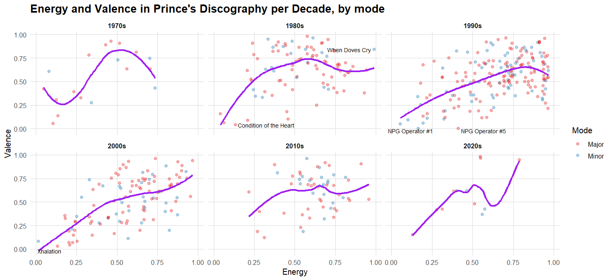
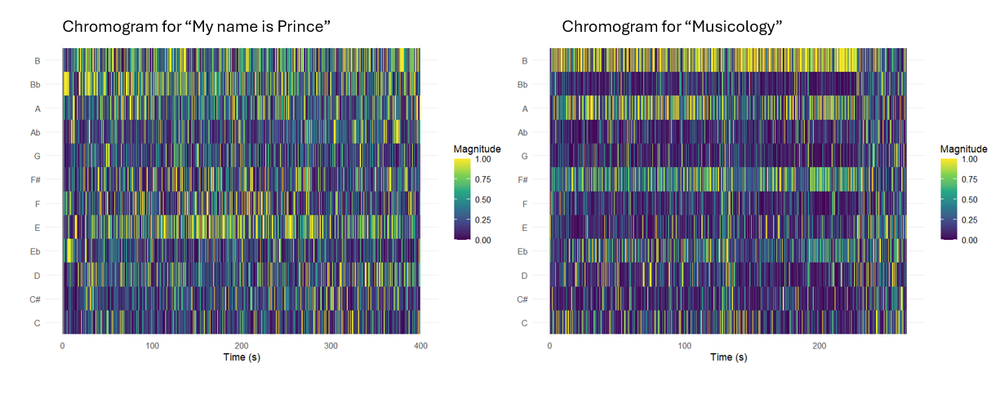

# Corpus description

## Column (width = 30%)

For my corpus, I use the complete discography of Prince. Prince's body of work spans more than four decades, from the late 1970's to the 2010's, and includes 39 studio albums and hundreds of tracks. His music is known for his stylistic diversity, blending funk, pop, rock, R&B and electronic influences. This makes his discography especially interesting for analysis: how do his musical characteristics evolve over time?

### Row (height = 20%)

# General patterns in corpus

## Column (width = 60%)

**Visualisation**

### Row

\

## Column

**Interpretation**

### Row

# Chroma features

## Column (width = 60%)

**Visualisations**

### Row

\

## Column

**Interpretation**

### Row

These visualisations show a comparison of the chromagram's of Prince's songs "My name is Prince" and "Musicology". I chose these songs because they are some of my favourite of Prince's discography, but they are in a very different style.\
The chromagram of "My name is Prince" shows that there is a wide variety of tones used throughout the entire piece: it does not follow the usual rules of using only a few chords that is traditional in western music. However, E, Bb and B do stand out slightly more. I think the reason for there being so many tones is because it contains a lot of rap (or rap-like singing) which is less focused on tone and more on rhythm.\
The chromagram of "Musicology" shows less diversity in tones, and a clearer adherence to the traditional tonal rules. Especially the tones B, A and F# stand out. What stands out in the chromagram are the two phases (around 125 seconds and at the end) where this tonal focus is a lot less strong. When listening to the song, the first interruption is a percussion section, where all melodic instruments stop playing and only a drumset and Prince's voice (speaking more than singing) can be heard. This explains why there is no clear tonal centre in that part. The ending is vague because there is a sort of intro for the next song, which does not match up with the rest of the song. It mainly contains speaking voice and fragments of other songs.

# Timbre features

## Column (width = 60%)

**Visualisations**

### Row (height = 50%)

Cepstrogram of the song "Musicology" by Prince 

### Row

Cepstrogram of the song "My name is Prince" by Prince 

## Column

**Interpretation**

### Row (height = 50%)

*Musicology* The first visualisation is a cepstrogram for the song "Musicology" by Prince. The visualisation shows relatively stable MFCC patterns, with smooth colour transitions and few abrupt shifts. This means that there is not a lot of diversity in the timbre of the song, which matches with the audio.

### Row

*My name is Prince* The second visualisation is a cepstrogram for the song "My name is Prince" by Prince. The visualisation shows more pronounced fluctuations across MFCC band, with sharper contrasts and more transitions than the previous cepstrogram. This means that it has more diverse content regarding timbre.

# Key and chord estimation

## Column (width = 60%)

**Visualisations**

### Row

## Column

**Interpretation**

## \### Row
