# Corpus description

## Column (width = 30%)

For my corpus, I use the complete discography of Prince. Prince's body of work spans more than four decades, from the late 1970's to the 2010's, and includes 39 studio albums and hundreds of tracks. His music is known for his stylistic diversity, blending funk, pop, rock, R&B and electronic influences. This makes his discography especially interesting for analysis: how do his musical characteristics evolve over time?

To test this, first an analysis of general patterns regarding energy, danceability and "era" was done to get an overall view of the corpus. Next, some songs were selected for more complex analyses regarding chroma features, timbre features, structure, tempo and clustering. These songs were selected based on personal preference and representation of different times in Prince's musical career.

“I Wanna Be Your Lover,” from the album "Prince" (1979), represents the early phase of Prince’s career. The track combines disco-influenced rhythms, prominent bass lines and bright synthesizer textures, characteristic of late-1970s funk-pop production.

“Purple Rain,” the title track of "Purple Rain" (1984), represents the peak of Prince’s commercial and artistic success in the mid-1980s. The song differs significantly from his earlier work in its slower tempo, expansive structure and strong rock influence.

Finally, “Musicology,” from the album "Musicology" (2004), represents Prince’s later career and his return to a more traditional funk and soul-oriented sound. Compared to the earlier examples, the track features a tighter groove, modern production techniques and a rhythm section that emphasizes syncopation and groove.

Together, these three songs provide a balanced sample of Prince’s musical output across different decades, genres and production styles. Because they differ in tempo, structure, instrumentation and recording aesthetics, they offer a varied yet coherent set of examples for in-depth music information retrieval analysis. By examining these tracks alongside the broader corpus, it becomes possible to connect detailed feature-level analysis to larger patterns in Prince’s artistic development.

# General patterns in corpus

## Column (width = 60%)

**Visualization**

### Row

## Column

**Interpretation**

### Row

The figure illustrates how the stylistic characteristics of songs by Prince evolved across his career, using danceability and energy as measures of musical style. Each point represents a song, coloured according to its career era, while the diamonds indicate the average position of each era. Overall, most songs cluster in the upper-right region of the plot, between roughly 0.6–0.9 in danceability and 0.5–0.9 in energy. This suggests that Prince’s music consistently emphasized rhythmically engaging and energetic compositions, reflecting his strong grounding in funk, R&B, and dance-oriented pop. A positive relationship between danceability and energy is also visible, as songs that are more danceable tend to be more energetic.

Songs from the early part of Prince’s career show a somewhat wider spread toward lower danceability and energy levels, indicating greater variation between slower R&B-influenced tracks and more rhythmically driven songs. The track “I Wanna Be Your Lover” appears relatively high in danceability, illustrating the strong funk influence that contributed to his early breakthrough. During the breakthrough period of the 1980s, the distribution shifts slightly toward higher energy while remaining highly danceable, reflecting the fusion of funk grooves with the more energetic sound of pop and rock that characterized some of his most commercially successful work. In contrast, the track “Purple Rain” occupies a position with lower danceability and energy than many other songs from this era, highlighting its nature as a slower, emotionally driven rock ballad.

The experimental period displays the greatest dispersion in the plot, suggesting a higher degree of stylistic diversity as Prince explored a wider range of genres and production styles. In the later phase of his career, songs again cluster strongly in the high-danceability region, indicating a continued emphasis on groove-driven compositions. The track “Musicology,” positioned near the centre of the overall distribution, appears stylistically representative of this later period. Despite these variations, the era averages remain relatively close to one another, suggesting that while Prince experimented widely throughout his career, the core stylistic qualities of his music (high rhythmic engagement and moderate to high energy) remained remarkably consistent.

# Chroma features

## Column (width = 60%)

**Visualizations**

### Row

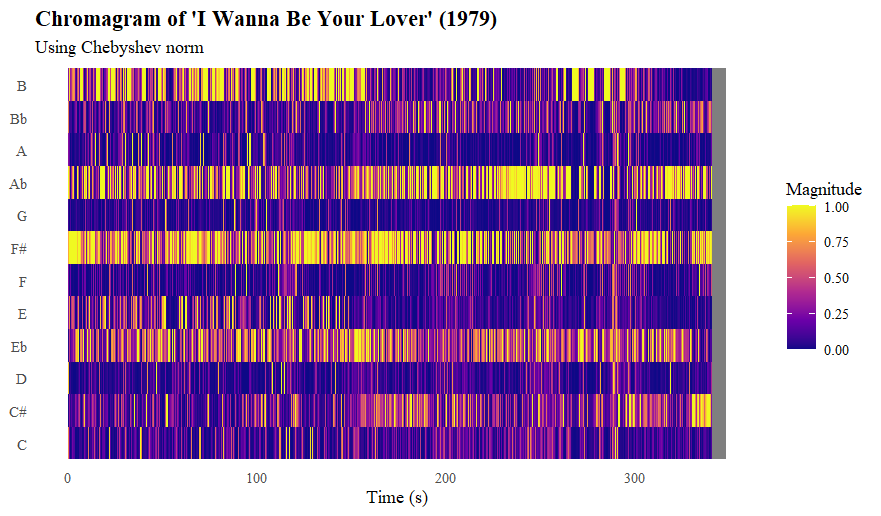

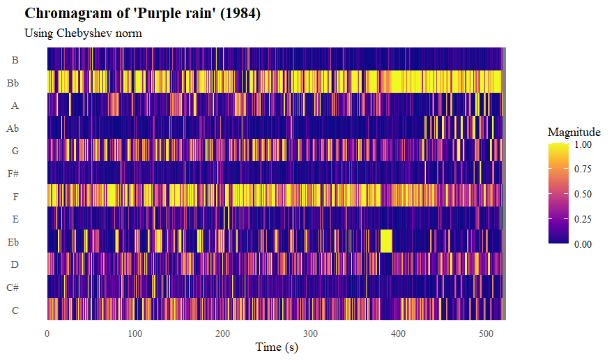

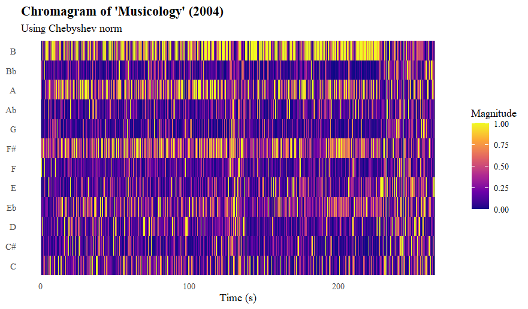

## Column

**Interpretation**

### Row

*I Wanna Be Your Lover*

The chromagram of "I Wanna Be Your Lover" (1979) shows that the piece is likely centered around a B major chord (B-E♭-F#). From t = 150 until t = 250 and in the outro, the B is much less prevalent. Instead, we see more C#. This could mean that this passage is built around a F# major chord (F3-B♭-C#), because we also see a slight increase in the B♭ row. When comparing this analysis to the audio, we see that the B major chord indeed fits most of the song. The decrease in B's around 150 seconds, occurs because there are significantly less chords used, the song becomes more melodic-based. Therefore, we keep hearing a lot of F#, because the song is based on this tone, but a lot less B.

### Row

*Purple Rain*

The chromagram of "Purple rain" (1984) reveals a very different, more repetitive harmonic profile, with dominant yellow bands in the F and B♭ rows. This indicates a b♭ major chord as the baseline for the song, because the D is more prevalent than the C#. This chord is indeed recognizable in the actual song. Unlike the other tracks, these horizontal bands are remarkably consistent from start to finish, with almost no major shifts in pitch energy. This visualization confirms the repetitive, loop-based nature of the track; the song relies on a tight, unchanging riff to maintain its "old school" funk feel rather than moving through distinct harmonic sections .

### Row

*Musicology*

In the chromagram of "Musicology", the tones B, A and F# stand out. The main chord seems to be a dominant B7 chord (B-E♭-F#-A), which matches the actual song when listening to it. What is interesting in the chromagram are the two phases (around 125 seconds and at the end) where this tonal focus is a lot less strong. When listening to the song, the first interruption is a percussion section, where all melodic instruments stop playing and only a drumset and Prince's voice (speaking more than singing) can be heard. This explains why there is no clear tonal centre in that part. The ending is vague because there is a sort of intro for the next song, which does not match up with the rest of the song. It mainly contains speaking voice and fragments of other songs.

# Cepstrograms

## Column (width = 60%)

**Visualizations**

### Row

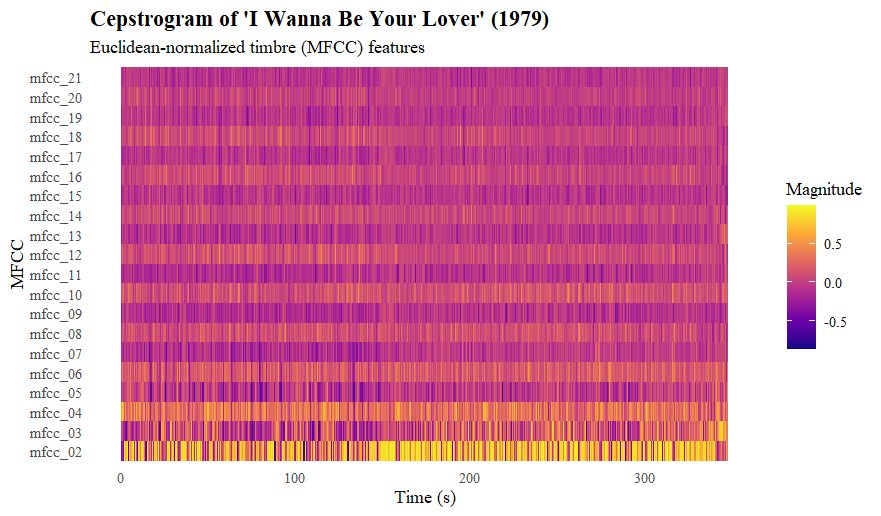

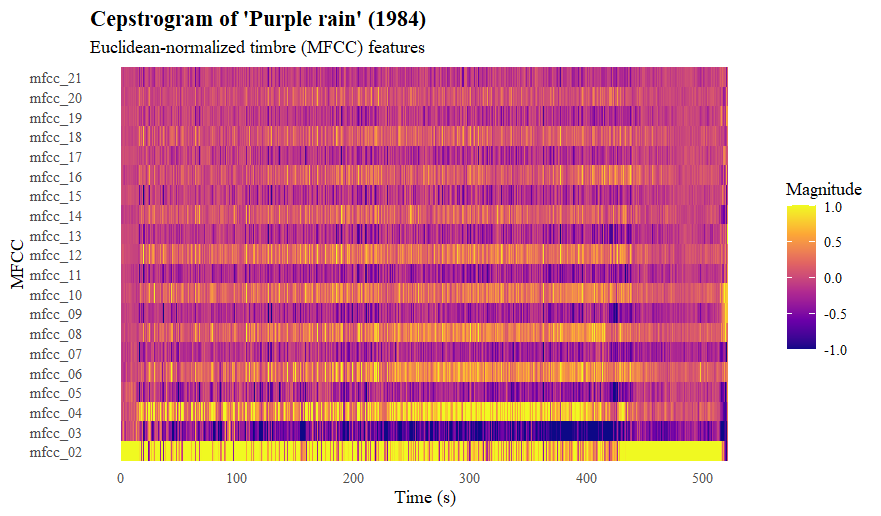

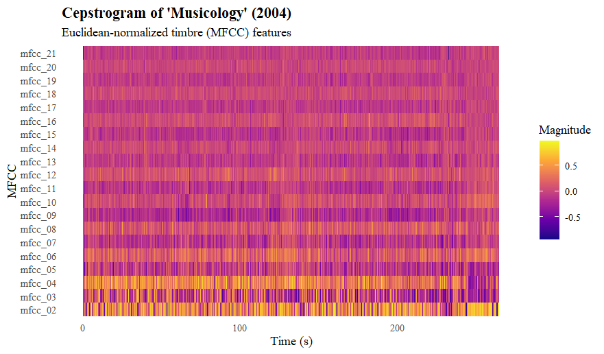

## Column

**Interpretation**

### Row

*I Wanna Be Your Lover*

In the cepstrogram of “I Wanna Be Your Lover,” the lower MFCCs (around mfcc_02 to mfcc_06) show the most movement, which you can see as small changes in color over time. These coefficients describe the broad shape of the sound: things like overall brightness and fullness, and those qualities do shift slightly throughout the song. When listening, this is noticeable by the way Prince’s vocals change tone from phrase to phrase, in the brighter moments of the rhythm guitar, and in the accents of the snare and hi‑hat. All of these create small but noticeable timbral changes, and that’s why the lower MFCCs aren’t completely flat.

The higher MFCCs (mfcc_15 and above) look much steadier, with fewer visible changes. This matches the audio as well: these coefficients capture very fine details such as noise, consonants, and tiny spectral variations. In this song, those elements stay quite consistent: the hi‑hat sound doesn’t change, the vocal microphone stays the same, and the guitar tone remains stable. Because the fine‑grained details don’t shift much, the higher MFCCs appear calmer in the plot.

Overall, the cepstrogram reflects the sound of the track: a bright, clean, and steady funk groove with small timbral variations in the vocals and rhythm section, but no dramatic changes in texture or instrumentation.

### Row

*Purple rain*

In the cepstrogram of “Purple Rain,” the lower MFCCs show the most movement, which fits the sound of the track. These coefficients react to broad timbral qualities like brightness and fullness, and those qualities shift throughout the song. You can hear this especially in Prince’s vocals: he moves from softer, more intimate singing in the verses to much more powerful, brighter phrases in the chorus and the emotional climax near the end. The electric guitar also changes character: sometimes clean and gentle, sometimes more intense. These shifts show up as variations in the lower MFCC rows.

The mid‑range MFCCs (mfcc_07 to mfcc_14) show smaller but still noticeable changes. These relate to the texture of the arrangement: the entrance of the backing vocals, the swelling synth pads, and the dynamic build‑up in the final section all create subtle changes in the spectral shape. You can see these as areas where the colors become slightly more varied or where the pattern thickens during louder or more layered parts of the song.

The higher MFCCs (mfcc_15 and above) look much calmer, with fewer visible changes. This makes sense when listening: the fine‑grained details of the sound, things like hi‑hat noise, vocal consonants, and small bits of distortion, stay fairly consistent throughout the track. The drum machine keeps the same sound, the synth pads are smooth, and the recording doesn’t introduce much extra noise. Because these details don’t shift dramatically, the higher MFCCs remain steady.

The finish of the song (from t = 420) clearly has a different timbre from the main part. When listening to the song, this is audible through the contrast in the outro to the rest of the song: the outro consists of violins playing with applause in the background, compared to the rock-ballad that is the rest of the song. This explains the contrast.

Overall, the cepstrogram reflects the emotional arc of Purple Rain: a song that starts gently, grows in intensity, and ends in a powerful, expressive climax.

### Row

*Musicology*

In the cepstrogram of “Musicology,” the lower MFCCs show the most movement, which fits the bright, punchy sound of the track. These rows react to changes in overall timbre, and you can hear those shifts in the sharp snare hits, the bright horn stabs, and Prince’s rhythmic, almost spoken vocal delivery. The mid‑range MFCCs move a bit less but still show changes when the arrangement thickens or when new instruments enter. The higher MFCCs stay mostly steady, which matches the consistent fine details in the audio: the hi‑hat sound, the vocal mic, and the clean production don’t change much. Altogether, the plot reflects a lively groove with lots of rhythmic detail but a very stable overall sound.

# Self-similarity matrix

## Column (width = 60%)

**Visualisations**

### Row

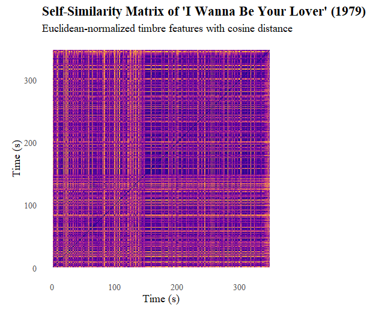

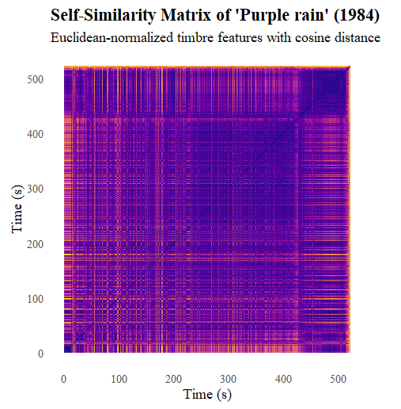

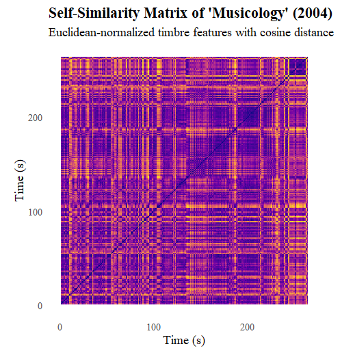

## Column

**Interpretation**

### Row

*I Wanna Be Your Lover*

The self‑similarity matrix of “I Wanna Be Your Lover” shows that the start of the song has a very steady and repeating timbral character. You can see this especially around t=110, which is a repeating refrain section. After this section, the timbral similarity decreases. This may have to do with the fact that the vocals stop, and it becomes a purely instrumental section.

The repeated lighter squares earlier in the matrix match the recurring verse–chorus pattern. Each verse sounds very similar to the others, and the choruses also share the same timbre, so they show up as repeated bright patches.

### Row

*Purple rain*

This song shows very little timbral similarity. This was already established from the cepstrogram, which showed large differences, but this self-similarity matrix shows that there are no clear repeating sections. Once again, the ending stands out especially as this has a radically different timbre from the rest of the song, as described in the cepstrogram interpretation. The start of the song shows the most similarity, though it is still very little: this is likely because this contains the "refrain" and "verses". After this section, the guitar solo has a significant different timbre.

An interesting observation is that in both songs, the start has the most timbral similarity, while the ending is often very different. This could point to a general pattern in music (e.g. the concept of "bridge"), or something inherent to Prince's style.

### Row

*Musicology*

The self-similarity matrix of "Musicology" is very different from the previous. It mainly contains a lot more timbral similarity, as also found in the cepstrograms. Around t = 140 until t = 160, there is a clear distinct section. This relates to the percussive break in the middle of the song, which was also established in the chromagram.

Though the difference is slight, here the greater timbral similarity at the start compared to the end is once again visible

# Chord estimation

## Column (width = 60%)

**Visualisations**

### Row

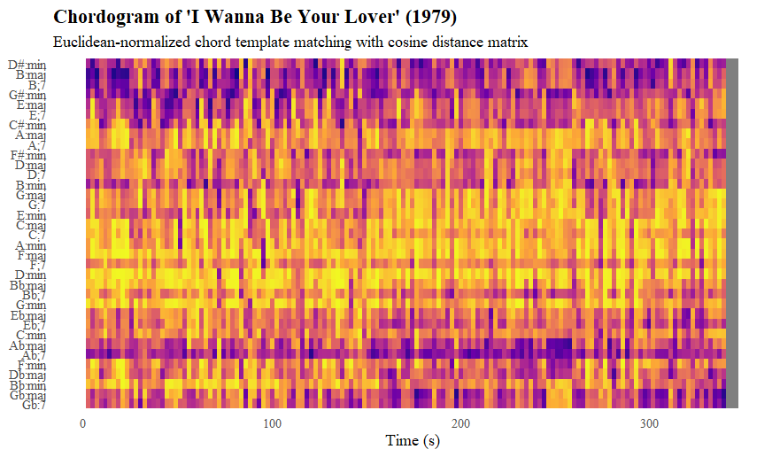

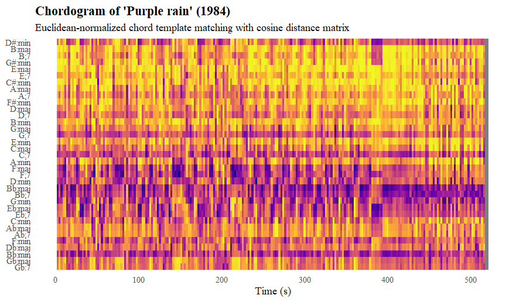

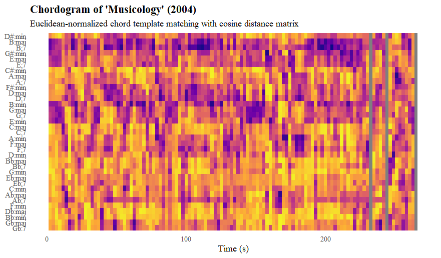

## Column

**Interpretation**

### Row

*I Wanna Be Your Lover*

The chordogram of "I Wanna Be Your Lover" shows that the chords B major, B7, G# minor and A♭ fit the best. Around t = 160 until t = 250, the chord G♭ major also has some activity. This corresponds with the findings of the chromagram, and would indicate that the key is B major, with the following chord functions. The key is tested on the page "Key estimation".

B major (I) - G# minor (VI) - A♭ (V7). G♭ is the dominant, so it makes sense that this chord eventually comes around in the song.

Only B7 stands out from this key. This may be a temporary dominant of E, which is the IV in B major and therefore a logical chord. However, it seems more likely that it is a misclassification, where the actual chord is the tonic B major, but due to other tones remaining or issues with classification, it gets assigned to B7.

### Row

*Purple Rain*

The chordogram of "Purple Rain" shows that the chords B♭ major, B♭7, F major and F7 are very prevalent. F minor and B♭ minor also occur frequently. The strongest chord therefore lies around B♭, with the F functioning as dominant. This corresponds with the findings from the chromagram. The chords have the following function in the key of B♭ major, determined on the page "Key classification":

B♭ major (I) - B♭7 (I7) - F major (V) - F7 (V7)

F minor and B&flat minor are once again most likely misclassifications, which is especially likely as the mode of the chord is dependent on the middle tone, which is often less audible than the base tone and fifth.

### Row

*Musicology*

The chordogram of "Musicology" shows that the chords B major, B7 and B minor are very prevalent. G major, G7, E major, E minor and E7 also occur frequently. The tonal centre lies seems to lie around B, which corresponds with the findings from the chromagram. The chords that are prevalent show that this song is really based on blues/funk system as opposed to more pop/rock systems. It uses uncommon chord types: IV –\> the E chords, ♭VI7 –\> the G chords if in B major. This may indicate that Prince returned to a more funky/blues style towards the end of his career.

# Key estimation

## Column (width = 60%)

**Visualisations**

### Row

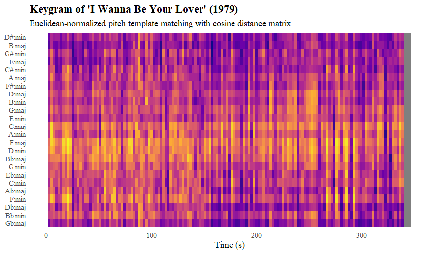

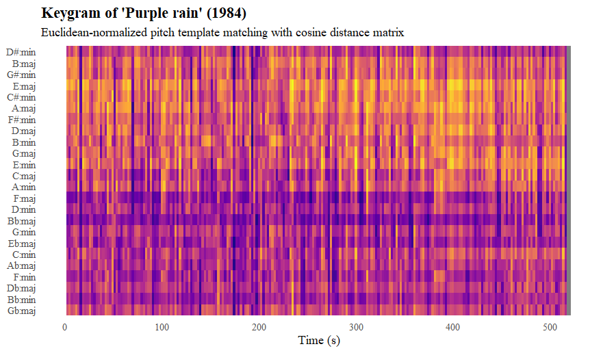

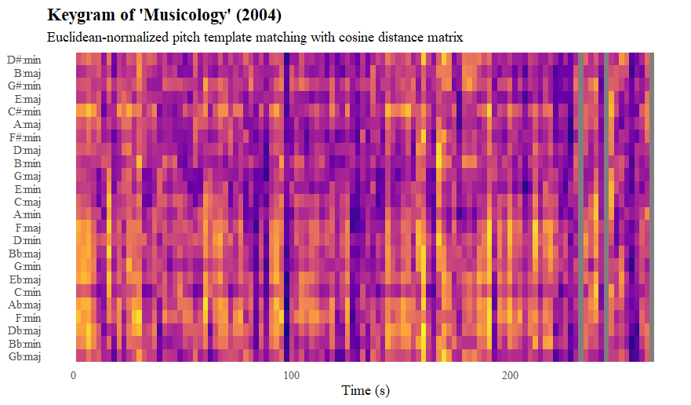

## Column

**Interpretation**

### Row

*I Wanna Be Your Lover*

This keygram shows what key is most likely for "I Wanna Be your Lover". B major seems the most likely candidate, which also aligns with findings from the chroma- and chordogram. Other options are E major, D♭ major and G♭ major.

### Row

*Purple rain*

This keygram shows what key is most likely for "Purple rain". F major and B&flat; major stand out as the most likely candidates. Overall, I think B♭ is the most likely candidate, because this seems slightly darker and also corresponds better with the previous results from the chroma- and chordogram.

### Row

*Musicology*

This keygram does not show a clear results for which key corresponds to "Musicology". Based on the previous results from the chordogram, I think this is because of the unusual harmonies used in the song, which makes it harder to approach a tonal centre. It is an interesting development and would be interesting to research further: does tonality decrease in the later stage of Prince's career?

# Tempo analysis

## Column (width = 60%)

**Visualisations**

### Row

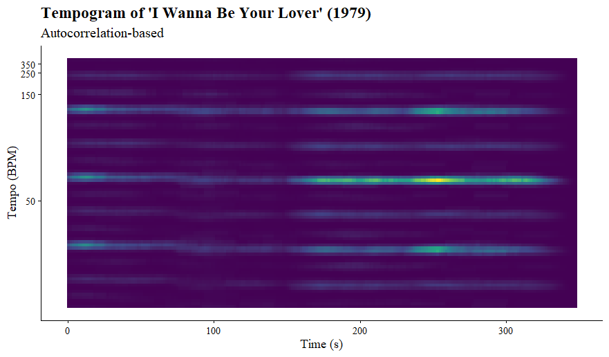

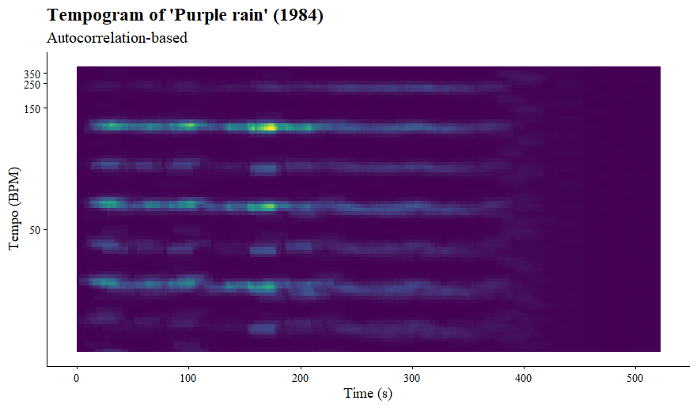

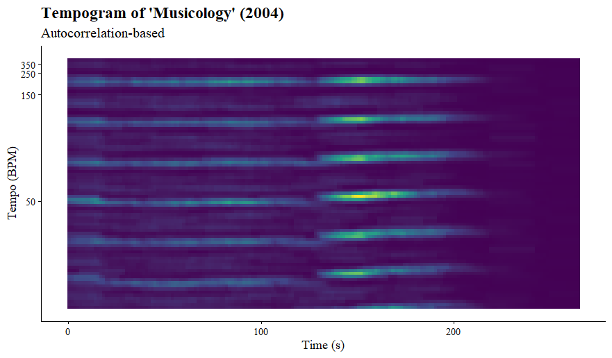

## Column

**Interpretation**

Because there are no great changes in tempo during the song, a comparison with the self similarity matrices was unfortunately not possible.

### Row

*I Wanna Be Your Lover*

The tempogram of "I Wanna Be Your Lover" shows clear lines around 30, 60 and 120 bpm. The brightest line is 60 bpm, but it is more likely that the tempo lies around 120 bpm, as this is a more comfortable tempo compared to 60 bpm. When listening to the song, it it audible that the tempo indeed lies around 120 bpm.

The tempogram shows no sudden changes in tempo. There are no clear tempo changes audible in the song, so this makes sense.

### Row

*Purple rain*

The tempogram of "Purple rain" shows clear lines around the same spots as "I Wanna Be Your Lover", so 30, 60 and 120 bpm. However, in this tempogram, the 120 bpm line seems the clearest. The remarkable aspect of this is that "Purple rain" aligns more with 60 bpm when listening to it. This relates to the smoother, calmer character of the song, compared to "I Wanna Be Your Lover".

This tempogram also shows no sudden changes, which corresponds to the song.

### Row

*Musicology*

The tempogram of "Musicology" shows a lot more lines than the previous song. The clearest lines are around 50, 100 and 200 bpm. The brightest line is the one of 50 bpm, but it would make the most sense for 100 bpm to be the tempo, and when listening to the song, that is indeed the best match.

There is a very slight acceleration around the middle of the song, but this acceleration is not audible in the actual song. This may be due to a small human error, perhaps there was no metronome used during the recording.

# Clustering

## Column (width = 60%)

**Visualisations**

### Row

## Column

**Interpretation**

To keep the visualisation clean, a random subset of 4 songs per album were chosen to use in the clustering.

### Row

The dendrogram visualizes the hierarchical clustering of a sample of songs from Prince’s discography, using complete linkage and Euclidean distance. The structure of the tree reflects the relative similarity between songs based on the musical features captured in the distance matrix: songs that merge at lower heights are more similar, while those that join only at higher levels are more distinct.

The key observation is that the resulting clusters do not align strictly with album boundaries. Although the dataset was constructed to include an equal number of songs per album, tracks from different albums frequently cluster together. This indicates that musical similarity in Prince’s work often transcends individual albums, suggesting continuity in style, production, or musical characteristics across different periods of his career. Rather than forming clearly separated album-based groups, the dendrogram reveals a more interconnected structure.

At lower levels of the hierarchy, several compact clusters emerge, representing groups of songs with high internal similarity. These clusters reflect shared musical traits. At higher levels, broader divisions become visible, indicating larger stylistic contrasts within the dataset. These higher-order clusters may correspond to different creative phases or contrasting musical directions in Prince’s oeuvre.

Overall, the dendrogram demonstrates that while local similarities between songs are clearly present, the global structure of the dataset is not organized around album membership. Instead, it reveals a continuum of musical styles, in which similarities and differences cut across album boundaries, reflecting both consistency and diversity within Prince’s discography.

# Conclusion

## Column

This computational analysis of Prince’s discography shows a career shaped by a pretty unique mix of constant experimentation and a strong, recognizable core style. Throughout this portfolio, a few clear patterns emerge about how his music developed over time.

**1. A Steady Rhythmic Core**

Even though Prince explored tons of genres over four decades, his music almost always stays rooted in high energy and strong danceability. His “breakthrough” years leaned more into pop-rock energy, and his more experimental phase spread out stylistically, but the groove never really disappears. You can see this in the tempo and general pattern data.

**2. More Complex Sounds and Structures Over Time**

Where things really change is in timbre and structure. Early tracks like *“I Wanna Be Your Lover”* have a pretty clean, consistent funk sound, with similar textures across verses and choruses. But in songs like *“Purple Rain,”* there’s way more variation in sound color. The cepstrogram shows noticeable shifts (especially in lower MFCCs), which line up with how the song builds emotionally: from softer, intimate sections to a big, layered climax.

There’s also a recurring structural pattern: many songs start out pretty repetitive and familiar, then gradually open up into more experimental sections. Examples are the extended guitar solo in *“Purple Rain”* or the percussive breakdown in *“Musicology.”* Prince uses structure as a way to move from order into exploration.

**3. Harmonic Shifts and a Funky Comeback**

The chord and chroma analysis points to an interesting change in how Prince handles harmony. Earlier hits tend to stick to clear keys (like B major or B♭ major), but later tracks get more harmonically ambiguous. For example, *“Musicology”* leans on blues-based ideas with less typical chords (like ♭VI7), making the tonal center harder to pin down.

Instead of aiming for clean, traditional pop harmony, his later work seems more focused on feel and groove, using complex funk and blues elements. That also explains why modern analysis tools have a harder time identifying a clear key in these tracks.

**4. One Continuous Style, Not Separate Eras**

When you look at the clustering analysis, it becomes clear that Prince’s music doesn’t neatly split into eras based on albums or time periods. Songs from completely different decades often group together because they share similar sonic features. That suggests his style is more of a continuous spectrum than a set of distinct phases.

In the end, even though his tools and production techniques evolved, his core idea stayed the same: a tight, engaging groove at the center of everything.
